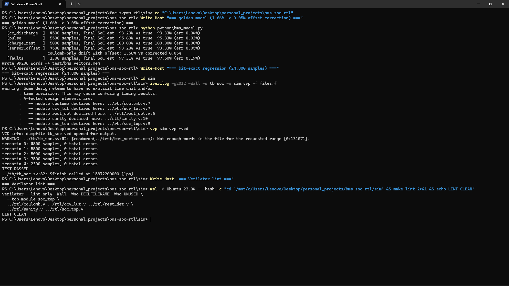
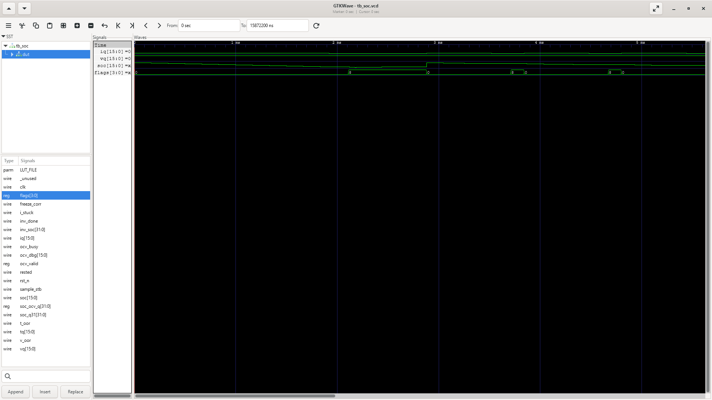

# BMS state-of-charge estimator (Verilog RTL)

A synthesizable battery state-of-charge estimator. It combines Coulomb
counting with an OCV-based correction that runs while the pack is at rest, and
a plausibility monitor that freezes the correction on bad sensor data. CI
checks it against a bit-exact Python golden model driven by a Thevenin 1-RC
cell plant.


## Demo

The golden model (the sensor-offset scenario shows 1.66% Coulomb-only drift vs 0.05%
corrected), the 24,800-sample bit-exact regression, and Verilator lint.



SoC and sensor traces across the five scenarios in GTKWave.



## How it works

```
I (Q7.9) ──┬─▶ rest_det ─────────────── rested ──┐
           ├─▶ sanity  ── freeze_corr ──────────┤
V (Q3.13) ─┤              (V/T range, stuck I)   ▼
           └────────────▶ coulomb: soc -= I·dt/Qnom, blend at rest ──▶ SoC (Q1.15)
T (Q7.1)  ─────────────▶  ocv_lut: 33-entry OCV(SoC) + inverse SoC(OCV)
                          (binary search + non-restoring divide, ~31 cycles)
```

Coulomb counter (`coulomb.v`): a Q1.31 accumulator (1.0 = 2^31). Each 100 Hz
sample does `ΔSoC = (I·K_DSOC)>>>8`, where `K_DSOC` comes from
`dt·2^31/(Q_nom·512)` (derived in the file). Charging (I < 0) gets 0.99
efficiency, and the accumulator saturates at [0, 100%].

OCV table (`ocv_lut.v`): 33 entries in Q3.13 on an NMC-shaped monotonic curve,
linearly interpolated. The inverse lookup (SoC from a rest voltage) is a
5-cycle binary search over the segments plus a 24-cycle non-restoring divide
for the fraction, about 31 cycles total, which fits easily in the 100 Hz
budget.

Rest detection (`rest_det.v`): |I| < 0.3 A for 3 s. While rested and not
frozen, the estimator blends `SoC += α·(SoC_ocv − SoC)`, α = 0.02 per sample
(about a 0.5 s pull time constant).

Plausibility (`sanity.v`): voltage and temperature range checks, plus
stuck-current detection (an identical reading for 2 s while |I| is above the
rest band). Below that band a stuck reading is indistinguishable from genuine
rest, and the OCV correction covers drift there anyway. Any flag freezes the
correction; Coulomb counting keeps running.

## Results

From `python/bms_model.py`, asserted in CI:

| scenario        | duration | final SoC error |
|-----------------|----------|-----------------|
| constant discharge + rest | 45 s | 0.04% |
| pulse discharge (urban-ish) | 55 s | 0.03% |
| charge with rest periods  | 50 s | 0.00% |
| +0.2 A sensor offset  | 75 s | 0.05% corrected vs 1.66% Coulomb-only |
| fault injection (V oor, hot T, stuck I) | 23 s | flags verified |

The sensor-offset row is the reason for the OCV blend. Pure Coulomb counting
integrates the offset into 1.66% drift; the rest-time correction pulls it back
to 0.05%.

## Layout

```
bms-soc-rtl/
├── rtl/  coulomb.v  ocv_lut.v  rest_det.v  sanity.v  soc_top.v
├── python/bms_model.py     # bit-exact estimator + Thevenin 1-RC plant
├── test/bms_vectors.mem
├── tb/tb_soc.sv
└── sim/Makefile
```

## Running it

```bash
cd sim
make            # build + run, expects "TEST PASSED"
make lint       # Verilator -Wall lint
make golden     # regenerate OCV table + vectors (deterministic)
```

## Verification

The golden model runs the same integer update chain as the RTL (order
documented at the top of `bms_model.py`) and generates the drive cycles from a
float Thevenin 1-RC plant (R0=50 mΩ, R1=30 mΩ, τ=3 s, scaled Q_nom=900 As so
the scenarios stay short). The testbench replays 24,800 samples across the
five scenarios and compares SoC and all four flags bit-for-bit on every
sample. Verilator (`-Wall`) lints all RTL in CI.

## Scope

This is Coulomb counting plus an OCV blend, not an EKF (a fixed-point EKF is
the listed stretch goal). Temperature currently only gates plausibility, with
no capacity or OCV temperature compensation, and power-on SoC assumes a full
pack.
